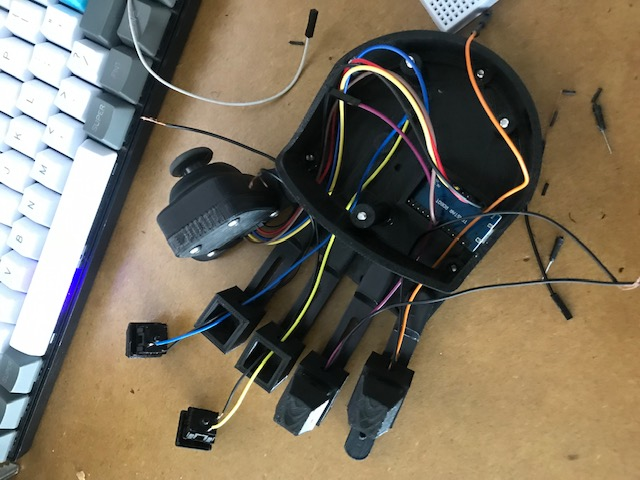

# Azeron Clone Gaming Controller
Azeron Clone - Arduino Micro Code

Tutorial Followed - https://www.instructables.com/Azeron-Game-Pad-DIY-Under-35/

STL Files Purchased for Clone - https://cults3d.com/en/3d-model/gadget/ergonomic-gaming-keypad-nagooyen

Keycap STL Files (Free) - https://www.thingiverse.com/thing:4542301

 

# Description
My original idea was to create a vertical version of the [Azeron Gaming Keypad](https://www.azeron.eu/gallery/). The gamepad would be rotated 90 degrees on it's side so the joystick would point up in its neutral position.

I spent a lot of time learning Blender and attempting to make the palm rest piece but failed to get the fit correct. I decided to opt with purchasing the STL from [Nagooyen](https://cults3d.com/en/users/Nagooyen) to speed up the process and then make modifications if need be. 

My first tweak to the design was to use Cherry MX switches (my preference here being blue) instead of the smaller switches provided. The reason for this was because I wanted to retain the feel of the mechanical keyboard I was currently using for gaming. The only downside to this design switch is a reduction of the number of keys on the gamepad, bringing it down from 12 to 4. This was fine for my gaming purposes. I reasoned that if I needed more keys down the road, I would create a separate numpad.

After completing this project, I'll be adjusting the palm rest as it doesn't quite fit my hand. I found it hard to get a good grip on the joystick without one of my other fingers pressing down on a switch. My solution will be to either try:
1. Import the current STL into Blender and attempting to modify it.
1. Start from scratch in Blender and learn how to make a similar palm rest.
1. Create the rotated 90 degree version of the controller and design an entirely new arm rest.
2. Put better grips on the base or pursue better methods of keeping the controller in place. 

 

# The Code
The Arduino code is currently in its first working state. It will be refactored down the road when I add a connected numpad.

The joystick can be in two different states; the first being an octa-directional WASD emulation and the second controlling mouse movement. The controller alternates between states via pressing down on the joystick switch (similar to L3 or R3 on a console controller). The reason the second state is not a joystick for gaming is because the game I'm using this for does not support simultaneous input from a controller and mouse/keyboard. This means using the joystick as actual analog input would sacrifice the use of the mouse.

Other pc games such as Fortnite supports this simultaneous input, so it may be worth modifying the secondary joystick state. The code contains some commented code for the [Joystick Library](https://github.com/MHeironimus/ArduinoJoystickLibrary) which can be easily enabled to replace the "mouse state".

 

# Pictures

